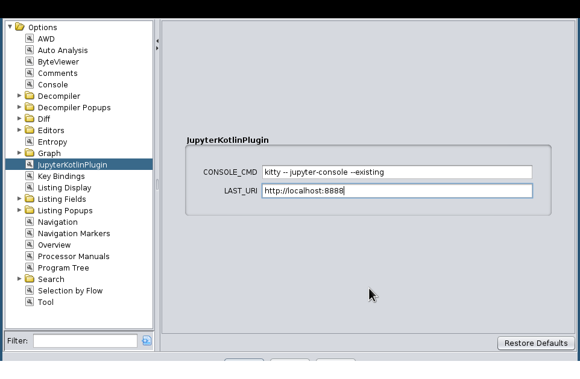

# Ghidra-Jupyter

## Automatic Installation

1. Use pip to install the kernel and the management utility
    
    ```bash
   pip install ghidra-jupyter
    ```
   
2. Use the management utility to install the extension.
   Make sure `$GHIDRA_INSTALL_DIR` is defined,
   as it points the utility to the right path.

    ```bash
    ghidra-jupyter install-extension
   ```
   
3. If you have multiple installations of Ghidra,
   you can point the installer to the right one.
   
   ```bash
   ghidra-jupyter install-extension --ghidra <my-ghidra-install-dir>
   ```
   
## Manual Installation

1. Use pip to install the kernel and the management utility
    
    ```bash
   pip install ghidra-jupyter
    ```
   
2. Download the [latest release](https://github.com/GhidraJupyter/ghidra-jupyter-kotlin/releases/latest) zip from our releases page
3. Place the zip under `$GHIDRA_INSTALL_DIR/Ghidra/Extensions/` or select it via the GUI dialog to install extensions
   
## Usage

After installation, you should be prompted about a new plugin when opening the CodeBrowser. Confirm the installation and activate it via "File -> Configure..." and ticking the checkbox for the "Miscellaneous" Group.

Directly after you'll see 2 new buttons and a new menu inside Ghidra.


The third action is only available in the menu and provides a shortcut
to open an already running `juptyter-notebook` server or to start a new one.


### Kotlin QtConsole

This feature requires the Jupyter QT Console to be installed and `jupyter-qtconsole` to be available in your `PATH`. This is a separate package on PyPI and in most distros, so you typically need to explicitly install it.

Click the ![QtConsole] button to open a QtConsole.

Once you click, a Jupyter Kernel will be initialized in the current Ghidra program
and the Jupyter QtConsole will launch. If there is already a notebook kernel running,
the console will use the same kernel (i.e. share the variables, functions, etc.)


#### Caveats

If you want to interrupt the code you executed, the menu action "Interrupt Current Kernel" or "Ctrl+C" will NOT work. It will simply print `Cannot interrupt a kernel I did not start.`

This is a limitation of the Jupyter QT console. To work around this issue, the plugin provides an action `Interrupt Execution` in the `Jupyter` submenu. This will interrupt the currently executed cell:


### Jupyter Terminal Console

If you want to use the terminal based `jupyter-console` instead,
open a CodeBrowser instance and in the top bar navigate to

`Edit -> Tool Options ... -> JupyterKotlinPlugin`



Here you can set the `CONSOLE_CMD` to whatever command opens your preferred terminal and runs
`jupyter-console --existing` in it. The connection file will be appended to it, so the full command called later will be
something like:

```sh
kitty -- jupyter-console --existing /home/user/.local/share/jupyter/runtime/kernel-3af276c1-ac24-4368-bbb4-94cdf082fa7a.json
```

### Jupyter Notebook

1. Start Jupyter Notebook or Jupyter Lab
   
   ```bash
   jupyter notebook
   ```
   
   or by using the menu action.

2. Click the ![Notebook] button in Ghidra to accept a notebook connection

   The following popup will show, indicating that Ghidra is actively waiting

   

3. In the Jupyter Notebook home page, create a Ghidra(Kotlin) notebook

   

   Once you do, the notebook will connect to your waiting Ghidra instance.
   
   

[QtConsole]:resources/readme/qtconsole.png
[Notebook]:resources/readme/notebook.png

## Demo Snippets

These snippets can be pasted directly in the QT console or a notebook cell.

### Kotlin Extensions

[Extensions](https://kotlinlang.org/docs/extensions.html#extensions-are-resolved-statically) are a Kotlin feature which allows extending existing classes with new methods, properties or operators. This allows various convenience features, especially combined with other Kotlin Features like operator overloading and easily providing lambdas. They need to be explicitly imported in your script/kernel before using them:

```kotlin
// Import all extensions in the GhidraJupyterKotlin.extensions.address package
import GhidraJupyterKotlin.extensions.address.*
```

If you end up writing any kind of extension method/property/operator we would be happy to receive a PR.
Not all extension provided are documented in the README.md, check the [extensions folder](./GhidraJupyterKotlin/src/main/java/GhidraJupyterKotlin/extensions) for all of them. Nearly all of them are fairly simple (a few lines at most) so they can also serve as good examples how to write your own.

#### Explicit Database Transactions

Unlike the Jython REPL, the Kotlin Kernel does NOT wrap each cell in an implicit Database transaction. Any attempt to modify the Database will result in `NoTransactionException: Transaction has not been started`.

Instead, there is an extension method on the `UndoableDomainObject` interface, that makes Database transactions explicit with minimal syntactic overhead:

```kotlin
import GhidraJupyterKotlin.extensions.misc.*

currentProgram.runTransaction {
	/* your code modifying the DB */
	currentProgram.name = "NewName"
}
```

If the code throws any kind of Exception the transaction will be aborted and the changes will be discarded.

This method can also be called with a transaction description:
```kotlin
currentProgram.runTransaction("Transaction Description") {
	currentProgram.name = "NewName"
}
```

For comparison, the regular Ghidra API for transactions:
```kotlin
val transactionID = currentProgram.startTransaction("Transaction Description")
/* your code modifying the DB */
currentProgram.name = "NewName"
currentProgram.endTransaction(transactionID, true) // true means the changes should be committed to the DB
```


#### Address Arithmetic with Operators

Unlike Java, Kotlin supports [operator overloading](https://kotlinlang.org/docs/operator-overloading.html). This can be used to make calculations involving addresses more comfortable:

```kotlin
import GhidraJupyterKotlin.extensions.address.*
import ghidra.program.model.address.Address
import ghidra.program.model.address.AddressRange

val x: Address = currentAddress + 0x10  // Address + Offset (Int or Long)
val y: Address = currentAddress - 0x10  // Address - Offset (Int or Long)
val z: Address = x - y 			// Difference between Addresses

val range: AddressRange = y..x // The range of addresses between currentAddress-0x10 and currentAddress+0x10

```

### Defining your own Imports and Helpers for Quick Access

You can load a JSON file e.g. `decompiler.json`

```json
{
  "link": "https://github.com/GhidraJupyter/ghidra-jupyter-kotlin",
  "description": "Shortcut to load features in Kotlin Kernel",
  "imports": [
    "GhidraJupyterKotlin.extensions.address.*",
    "GhidraJupyterKotlin.extensions.data.*",
    "GhidraJupyterKotlin.extensions.misc.*",
    "ghidra.app.decompiler.*"
  ],
   "init" : [
      "val ClangNode.parent: ClangTokenGroup; get() = this.Parent() as ClangTokenGroup",
      "val ClangNode.children: List<ClangNode>; get() = (0..this.numChildren()-1).map(this::Child)",
      "val currentToken: ClangToken?; get() = (currentLocation as? DecompilerLocation)?.token"
   ]
}
```

and then activate it:
```
%use /PATH/TO/FILE/decompiler
```

If the file is placed under `$HOME/.jupyter_kotlin/libraries`, you only need to use the name, e.g. `%use decompiler`

When activated, the `imports` will be made available just like with a manual import
and each line in `init` will be run once. This means that the extension methods defined in the imports are available too.
You can also import other packages to easily access classes, e.g. for `(currentLocation as DecompilerLocation).token`

The `init` block in this example defines three [Extension Properties](https://kotlinlang.org/docs/extensions.html#extension-properties).
1. Work around the annoying name of the `ClangNode.Parent()` function and
the quirk that this should always be a `ClangTokenGroup`, but isn't typed as such in Ghidra itself. 
2. A function that collects all the children of a node into a list (which then works with `.map` etc.)
3. Add a value/property to directly access the currently selected token.

Combined this means you can now open a console via the GUI, run `%use decompiler`, click on a token in the decompiler,
and run
```
In [1]: %use decompilerKotlin 
In [2]: currentToken.parent.children
Out[2]: [pcVar2,  , =,  , "startUpdatingLocation"]
```

For a full list of possibilities check the [official documentation](https://github.com/Kotlin/kotlin-jupyter/blob/master/docs/libraries.md#creating-library-descriptor)


## Building the Ghidra Plugin

(requires at least Ghidra 10.1 to be this easy, earlier versions require copying libraries around)
1. Run `gradlew buildExtension -PGHIDRA_INSTALL_DIR=/path/to/ghidra_10.1_PUBLIC` and gradle should take care of
pulling the dependencies, copying them to the `./lib` folder, and building the extension zip to
`./GhidraJupyterKotlin/dist/*zip`
2. Install the plugin using the ghidra-jupyter installer
   ```bash
   ghidra-jupyter install-extension --extension-path GhidraJupyterKotlin/dist/<today's-zip-file>
   ```
   
### Development (Ghidra Extension itself, Kotlin GhidraScripts and Kotlin Extension Methods)

Developing this extension is only tested and supported with IntelliJ, which isn't officially supported as an IDE for
Ghidra Extensions.

First make sure that your `GHIDRA_INSTALL_DIR` variable is set in some way that gradle recognizes,
e.g. by adding the  line `GHIDRA_INSTALL_DIR=/path/to/ghidra_10.1_PUBLIC/`
to the global gradle config in `$HOME/.gradle/gradle.properties`

Now it should be enough to import the `settings.gradle` file via the
IntelliJ IDEA "Project From Existing Sources" menu.
IntelliJ will import the gradle project, fetch dependencies and
afterwards you can click the `Build` button (Hammer in the top right menu) and it should compile successfully.
If there is an error during importing or building please open an issue here on GitHub.

The repo also includes a run configuration under `.idea/runConfigurations/Ghidra_GUI.xml` that IntelliJ should
automatically pick up after the project was created, which will add a run configuration called `Ghidra GUI`.
This run configuration will launch Ghidra  with the current
development code of the plugin. It will look fairly ugly because none of the VM options that influence that are included.
To remedy this, generate the VM options for your system and set them as the VM options in the run configuration.

```sh
cd $GHIDRA_INSTALL_DIR
java -cp ./support/LaunchSupport.jar LaunchSupport ./support/.. -vmargs
```


## Licenses

This project is released under the MIT license.

The project uses components that are released under different licenses:

- [kotlin-jupyter](https://github.com/Kotlin/kotlin-jupyter) is released under the Apache-2.0 License
- The Kotlin runtime and libraries are released under the Apache-2.0 License
