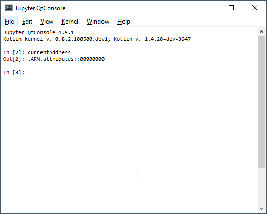
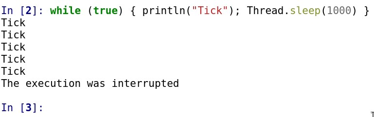
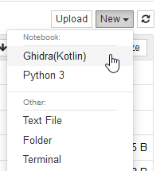
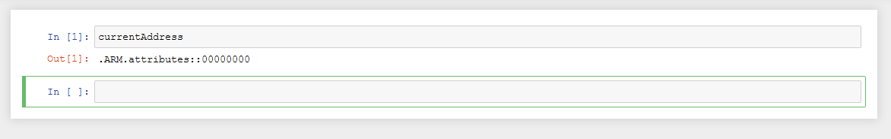

# Ghidra-Jupyter

## Automatic Installation

1. Use pip to install the kernel and the management utility
    
    ```bash
   pip install ghidra-jupyter
    ```
   
2. Use the management utility to install the extension.
   Make sure `$GHIDRA_INSTALL_DIR` is defined,
   as it points the utility to the right path.

    ```bash
    ghidra-jupyter install-extension
   ```
   
3. If you have multiple installs of Ghidra,
   you can point the installer to the right one.
   
   ```bash
   ghidra-jupyter install-extension --ghidra <my-ghidra-install-dir>
   ```
   
## Manual Installation

1. Use pip to install the kernel and the management utility
    
    ```bash
   pip install ghidra-jupyter
    ```
   
2. Download `GhidraJupyterKotlin-1.0.0.zip` from our releases page
3. Place the zip under `$GHIDRA_INSTALL_DIR/Ghidra/Extensions/`
   
## Usage

After installation, you should be prompted about a new plugin when opening the CodeBrowser. Confirm the installation and activate it via "File -> Configure..." and ticking the checkbox for the "Miscellaneous" Group.

Directly after you'll see 2 new buttons and a new menu inside Ghidra.


The third action is only available in the menu and provides a shortcut
to open an already running `juptyter-notebook` server or to start a new one.


### Kotlin QtConsole

This feature requires the Jupyter QT Console to be installed and `jupyter-qtconsole` to be available in your `PATH`. This is a separate package on PyPI and in most distros, so you typically need to explicitly install it.

Click the ![QtConsole] button to open a QtConsole.

Once you click, a Jupyter Kernel will be initialized in the current Ghidra program
and the Jupyter QtConsole will launch.



#### Caveats

If you want to interrupt the code you executed, the menu action "Interrupt Current Kernel" or "Ctrl+C" will NOT work. It will simply print `Cannot interrupt a kernel I did not start.`

This is a limitation of the Jupyter QT console. To work around this issue, the plugin provides an action `Interrupt Execution` in the `Jupyter` submenu. This will interrupt the curently executed cell:




### Jupyter Notebook

1. Start Jupyter Notebook or Jupyter Lab
   
   ```bash
   jupyter notebook
   ```
   
   or by using the menu action.

2. Click the ![Notebook] button in Ghidra to accept a notebook connection

   The following popup will show, indicating that Ghidra is actively waiting

   

3. In the Jupyter Notebook home page, create a Ghidra(Kotlin) notebook

   

   Once you do, the notebook will connect to your waiting Ghidra instance.
   
   

[QtConsole]:resources/readme/qtconsole.png
[Notebook]:resources/readme/notebook.png

## Building the Ghidra Plugin

1. Get the [kotlin-jupyter-kernel] jars
   1. Install the Kotlin Jupyter kernel
      ```bash
      pip install kotlin-jupyter-kernel
      ```
   2. Copy the JARs over to `GhidraJupyterKotlin/lib`
      1. First, we use `pip show kotlin-jupyter-kernel` to see where it was installed
         ```bash
         pip show kotlin-jupyter-kernel
         ```
      
      2. From the Location line (usually site-packages) we go to the run-kotlin-kernel package and copy the jars.
         So `site-packages/run-kotlin-kernel/jars/*`. The contents should be:
         ```text
         annotations-13.0.jar
         jupyter-lib-0.8.3.1.jar
         kotlin-jupyter-kernel-0.8.3.1.jar
         kotlin-reflect-1.4.30-dev-2223.jar
         kotlin-script-runtime-1.4.30-dev-2223.jar
         kotlin-stdlib-1.4.30-dev-2223.jar
         kotlin-stdlib-common-1.4.30-dev-2223.jar
         ```
   3. Build the Ghidra plugin
      ```bash
      cd GhidraJupyterKotlin
      gradle
      ```
   4. Install the plugin using the ghidra-jupyter installer
      ```bash
      ghidra-jupyter install-extension --extension-path GhidraJupyterKotlin/dist/<today's-zip-file>
      ```
      
## Licenses

This project is released under the MIT license.

The project uses components that are released under different licenses:

- [kotlin-jupyter](https://github.com/Kotlin/kotlin-jupyter) is released under the Apache-2.0 License
- The Kotlin runtime and libraries are released under the Apache-2.0 License
